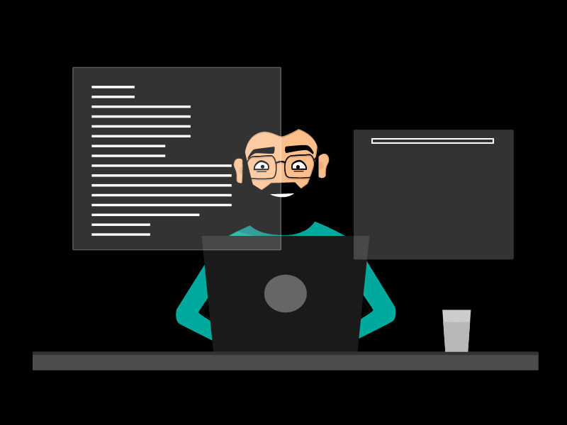

<!-- Animated Header -->

<!-- GIF -->

<!-- Dynamic Typing Text -->

  

<!-- Gateway & Support -->

&nbsp;

 

 

<!-- About Section -->
## 👨‍💻 About Me

I am a Full-Stack Engineer with a deep passion for **Edge-Tech** and system architecture. I specialize in building robust, scalable, and immersive digital experiences. Whether it's crafting high-performance backends or pixel-perfect frontends, I love turning complex problems into elegant solutions.

- 🔭 I’m currently building immersive web applications.
- 🌱 I’m constantly exploring advanced system design and architecture.
- 💬 Ask me about `TypeScript`, `NestJS`, `Next.js`, and `.NET`.
- 📫 How to reach me: **alireza.abedi9310@gmail.com**

 

<!-- Tech Stack -->
## 🛠️ Tech Arsenal

<h4>🎨 Frontend Development</h4>

  

<h4>⚙️ Backend & Frameworks</h4>

  

<h4>🗄️ Databases & Tools</h4>

  

 

<!-- GitHub Stats (Smaller & Aligned) -->
## 📈 Engineering Metrics

  

<table border="0" align="center">
  <tr>
    <td align="center" width="33%">
      
    </td>
    <td align="center" width="33%">
      
    </td>
    <td align="center" width="33%">
      
    </td>
  </tr>
</table>

 

  

<!-- Connect Section -->
## 📫 Let's Connect

&nbsp;

&nbsp;

&nbsp;

  

<!-- Animated Footer -->

